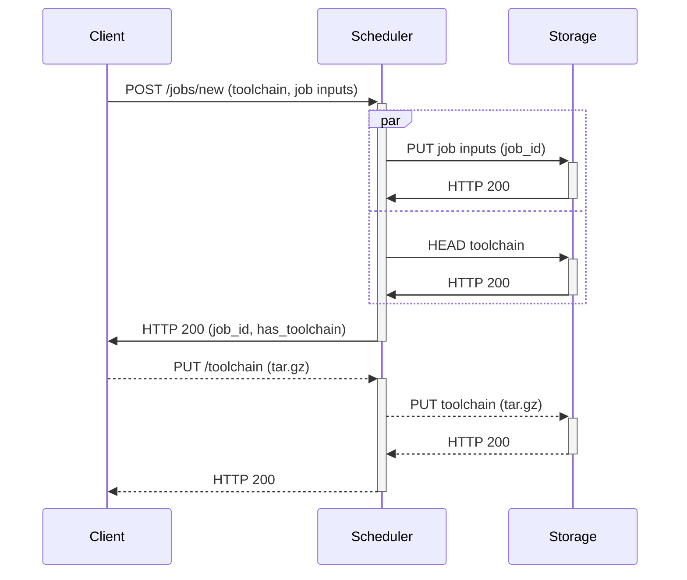
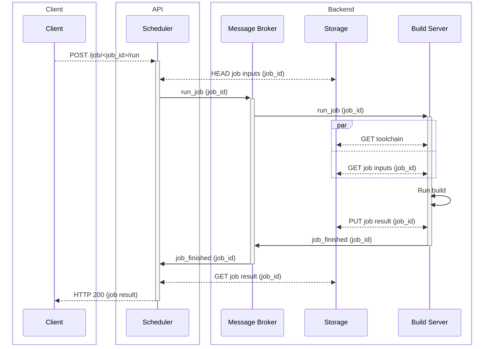

# API

## `POST /api/v2/jobs/new`

```mermaid
sequenceDiagram
    Client->>+Scheduler: POST /jobs/new (toolchain, job inputs)
    par
    Scheduler->>+Storage: PUT job inputs (job_id)
    Storage->>-Scheduler: HTTP 200
    and
    Scheduler->>+Storage: HEAD toolchain
    Storage->>-Scheduler: HTTP 200
    end
    Scheduler->>-Client: HTTP 200 (job_id, has_toolchain)
    Client-->>+Scheduler: PUT /toolchain (tar.gz)
    Scheduler-->>+Storage: PUT toolchain (tar.gz)
    Storage-->>-Scheduler: HTTP 200
    Scheduler-->>-Client: HTTP 200
```

## `POST /api/v2/job/<job_id>`

```mermaid
sequenceDiagram
    box Client
    participant Client
    end
    box API
    participant Scheduler
    end
    box Backend
    participant Message Broker
    participant Storage
    participant Build Server
    end
    Client-->>+Scheduler: POST /job/<job_id>/run
    Scheduler<<-->>Storage: HEAD job inputs (job_id)
    Scheduler->>+Message Broker: run_job (job_id)
    Message Broker->>+Build Server: run_job (job_id)
    par
    Build Server<<-->>Storage: GET toolchain
    and
    Build Server<<-->>Storage: GET job inputs (job_id)
    end
    Build Server<<->>Build Server: Run build
    Build Server<<-->>Storage: PUT job result (job_id)
    Build Server->>-Message Broker: job_finished (job_id)
    Message Broker->>-Scheduler: job_finished (job_id)
    Scheduler<<-->>Storage: GET job result (job_id)
    Scheduler-->>-Client: HTTP 200 (job result)
```
