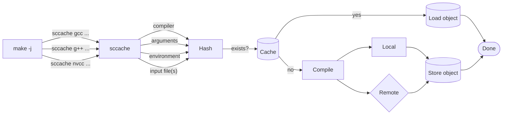

# sccache client

```mermaid
flowchart LR
    make["make -j"] -->|sccache gcc ...| sccache
    make["make -j"] -->|sccache g++ ...| sccache
    make["make -j"] -->|sccache nvcc ...| sccache
    sccache --> |"compiler"| hash
    sccache --> |"arguments"| hash
    sccache --> |"environment"| hash
    sccache --> |"input file(s)"| hash
    hash[Hash] -->|exists?| cache[("Cache")]
    cache -->|yes| hit
    cache -->|no| miss["Compile"]
    hit[("Load object")] --> done
    miss --> Local[Local]
    miss --> Remote{Remote}
    Local --> Store
    Remote --> Store
    Store[("Store object")] --> done
    done([Done])
```
