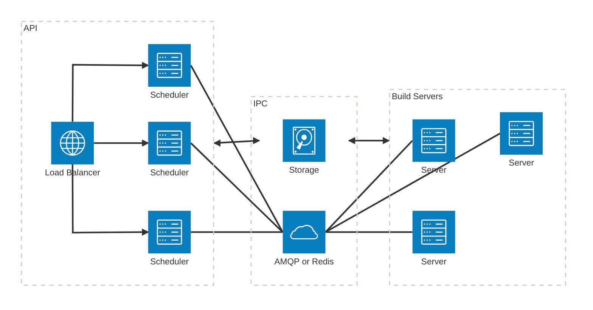

# sccache-dist Architecture

```mermaid
architecture-beta
    group api[API]
    group ipc[IPC]
    group builders[Build Servers]

    service s3(disk)[Storage] in ipc
    service lb(internet)[Load Balancer] in api
    service scheduler1(server)[Scheduler] in api
    service scheduler2(server)[Scheduler] in api
    service scheduler3(server)[Scheduler] in api
    service amqp(cloud)[AMQP or Redis] in ipc
    service server1(server)[Server] in builders
    service server2(server)[Server] in builders
    service server3(server)[Server] in builders

    lb:T --> L:scheduler1
    lb:R --> L:scheduler2
    lb:B --> L:scheduler3

    scheduler1:R -- L:amqp
    scheduler2:R -- L:amqp
    scheduler3:R -- L:amqp
    scheduler2{group}:R <--> L:s3{group}

    amqp:R -- L:server1
    amqp:R -- L:server2
    amqp:R -- L:server3
    s3{group}:R <--> L:server2{group}
```
