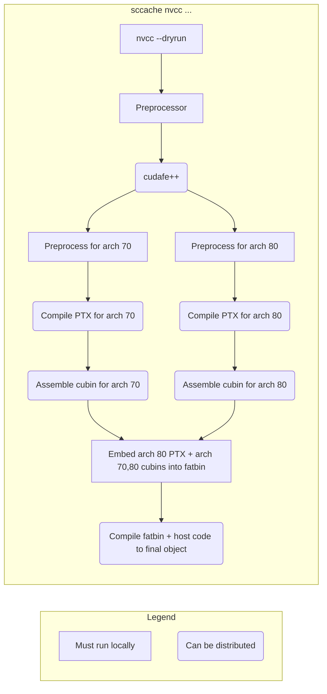

```mermaid
flowchart LR
    subgraph Legend
        local["Must run locally"]
        dist("Can be distributed")
    end
    subgraph "sccache nvcc ..."
        nvcc["nvcc --dryrun"] --> preprocessor
        preprocessor["Preprocessor"] --> cudafe("cudafe++")
        cudafe --> preprocessor-arch-70["Preprocess for arch 70"]
        cudafe --> preprocessor-arch-80["Preprocess for arch 80"]
        preprocessor-arch-70 --> cicc-arch-70("Compile PTX for arch 70")
        cicc-arch-70 --> ptxas-arch-70("Assemble cubin for arch 70")
        ptxas-arch-70 --> fatbin["Assemble arch 70 cubin and arch 80 PTX and cubin into fatbin"]
        preprocessor-arch-80 --> cicc-arch-80("Compile PTX for arch 80")
        cicc-arch-80 --> ptxas-arch-80("Assemble cubin for arch 80")
        ptxas-arch-80 --> fatbin["Embed arch 80 PTX + arch 70,80 cubins into fatbin"]
        fatbin --> compile-final-object("Compile fatbin + host code to final object")
    end
```
